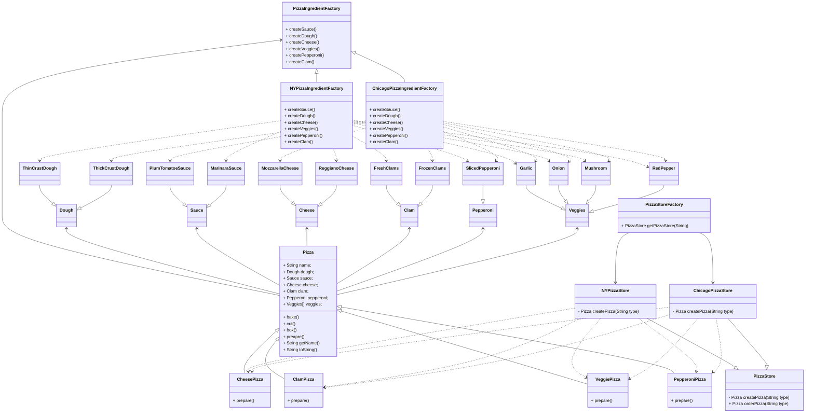

```mermaid
classDiagram
    class PizzaIngredientFactory {
        + createSauce()
        + createDough()
        + createCheese()
        + createVeggies()
        + createPepperoni()
        + createClam()
    }

    class NYPizzaIngredientFactory{
        + createSauce()
        + createDough()
        + createCheese()
        + createVeggies()
        + createPepperoni()
        + createClam()
    }

    class ChicagoPizzaIngredientFactory{
        + createSauce()
        + createDough()
        + createCheese()
        + createVeggies()
        + createPepperoni()
        + createClam()
    }

    class Pizza{
        + String name;
	    + Dough dough;
	    + Sauce sauce;
	    + Cheese cheese;
	    + Clam clam;
        + Pepperoni pepperoni;
        + Veggies[] veggies;
        + bake()
        + cut()
        + box()
        + preapre()
        + String getName()
        + String toString()
    }

    class CheesePizza{
    + prepare()
    }
    class VeggiePizza{
    + prepare()
    }
    class ClamPizza{
    + prepare()
    }
    class PepperoniPizza{
    + prepare()
    }

    PizzaIngredientFactory <|-- NYPizzaIngredientFactory
    PizzaIngredientFactory <|-- ChicagoPizzaIngredientFactory
    PizzaIngredientFactory <-- Pizza

    ThinCrustDough --|> Dough
    ThickCrustDough --|> Dough
    PlumTomatoeSauce --|> Sauce
    MarinaraSauce --|> Sauce
    FreshClams --|> Clam
    FrozenClams --|> Clam
    Garlic --|> Veggies
    Onion --|> Veggies
    Mushroom --|> Veggies
    RedPepper --|> Veggies
    MozzarellaCheese --|> Cheese
    ReggianoCheese --|> Cheese
    SlicedPepperoni --|> Pepperoni

    Dough <-- Pizza
    Sauce <-- Pizza
    Cheese <-- Pizza
    Clam <-- Pizza
    Pepperoni <-- Pizza
    Veggies <-- Pizza


    NYPizzaIngredientFactory ..> ReggianoCheese
    ChicagoPizzaIngredientFactory ..> MozzarellaCheese
    NYPizzaIngredientFactory ..> FreshClams
    ChicagoPizzaIngredientFactory ..> FrozenClams
    NYPizzaIngredientFactory ..> ThinCrustDough
    ChicagoPizzaIngredientFactory ..> ThickCrustDough
    NYPizzaIngredientFactory ..> SlicedPepperoni
    ChicagoPizzaIngredientFactory ..> SlicedPepperoni
    NYPizzaIngredientFactory ..> MarinaraSauce
    ChicagoPizzaIngredientFactory ..> PlumTomatoeSauce
    NYPizzaIngredientFactory ..> Garlic
    ChicagoPizzaIngredientFactory ..> Garlic
    NYPizzaIngredientFactory ..> Onion
    ChicagoPizzaIngredientFactory ..> Onion
    NYPizzaIngredientFactory ..> Mushroom
    ChicagoPizzaIngredientFactory ..> Mushroom
    NYPizzaIngredientFactory ..> RedPepper
    ChicagoPizzaIngredientFactory ..> RedPepper

    Pizza <|-- CheesePizza
    Pizza <|-- ClamPizza
    Pizza <|-- VeggiePizza
    Pizza <|-- PepperoniPizza

    class PizzaStore {
        - Pizza createPizza(String type)
        + Pizza orderPizza(String type)
    }

    class NYPizzaStore {
        - Pizza createPizza(String type)
    }

    class ChicagoPizzaStore {
        - Pizza createPizza(String type)
    }

    class PizzaStoreFactory {
        + PizzaStore getPizzaStore(String)
    }

    NYPizzaStore --|> PizzaStore
    ChicagoPizzaStore --|> PizzaStore

    NYPizzaStore ..> CheesePizza
    ChicagoPizzaStore ..> CheesePizza
    NYPizzaStore ..> ClamPizza
    ChicagoPizzaStore ..> ClamPizza
    NYPizzaStore ..> PepperoniPizza
    ChicagoPizzaStore ..> PepperoniPizza
    NYPizzaStore ..> VeggiePizza
    ChicagoPizzaStore ..> VeggiePizza

    PizzaStoreFactory --> NYPizzaStore
    PizzaStoreFactory --> ChicagoPizzaStore

```