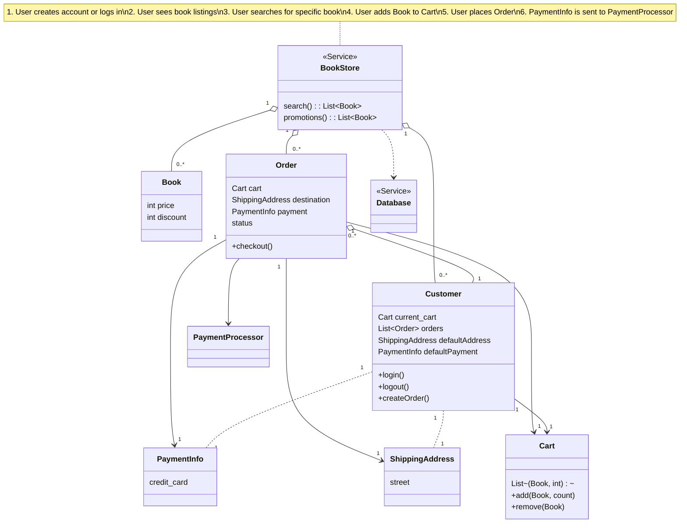

```mermaid
classDiagram
    class BookStore {
        search(): List~Book~
        promotions(): List~Book~
    }
    class Book {
        int price
        int discount
    }
    class Cart {
        List~(Book, int)~
        +add(Book, count)
        +remove(Book)
    }
    class Order {
        Cart cart
        ShippingAddress destination
        PaymentInfo payment
        status

        +checkout()
    }
    class Customer {
        Cart current_cart
        List~Order~ orders
        ShippingAddress defaultAddress
        PaymentInfo defaultPayment

        +login()
        +logout()
        +createOrder()
    }
    class PaymentInfo {
        credit_card
    }
    class ShippingAddress {
        street
    }

    class Database
    class PaymentProcessor
    <<Service>> BookStore
    <<Service>> Database

    Order "1" --> "1" PaymentInfo
    Order "1" --> "1" ShippingAddress
    Order "1" --> "1" Cart

    BookStore "1" o-- "0..*" Book
    BookStore "1" o-- "0..*" Order
    BookStore "1" o-- "0..*" Customer
    Customer "1" --> "1" Cart
    Order "0..*" o-- "1" Customer
    Customer "1" .. "1" ShippingAddress
    Customer "1" .. "1" PaymentInfo

    BookStore ..> Database
    %% Database --> Order
    %% Database --> Cart
    %% Database --> Customer
    %% Database --> Book

    Order --> PaymentProcessor

    note for BookStore "1. User creates account or logs in\n2. User sees book listings\n3. User searches for specific book\n4. User adds Book to Cart\n5. User places Order\n6. PaymentInfo is sent to PaymentProcessor"
```