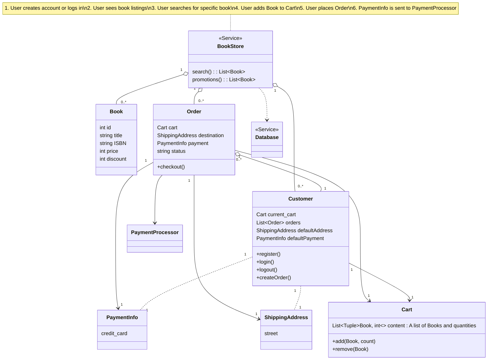
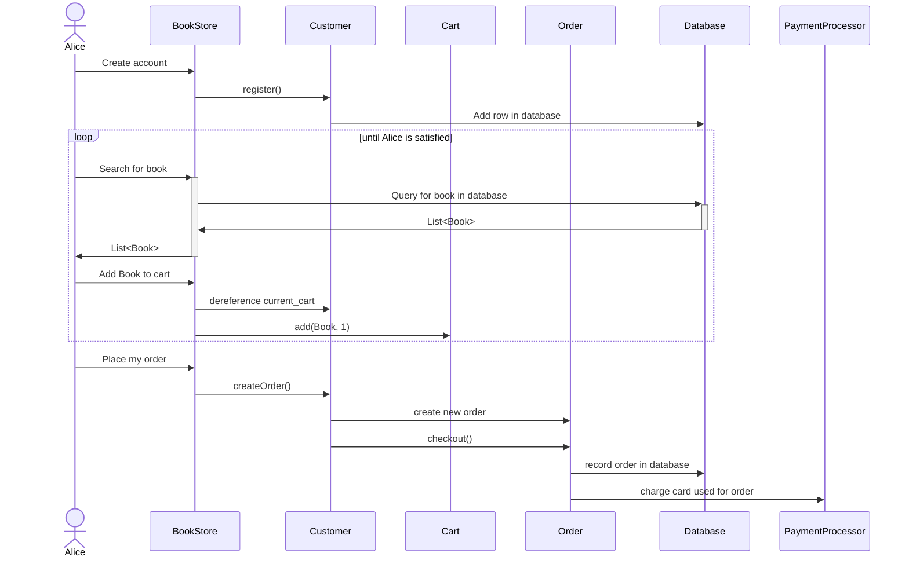

```mermaid
classDiagram
    class BookStore {
        search(): List~Book~
        promotions(): List~Book~
    }
    class Book {
        int id
        string title
        string ISBN
        int price
        int discount
    }
    class Cart {
        List~Tuple~Book, int~~ content : A list of Books and quantities
        +add(Book, count)
        +remove(Book)
    }
    class Order {
        Cart cart
        ShippingAddress destination
        PaymentInfo payment
        string status

        +checkout()
    }
    class Customer {
        Cart current_cart
        List~Order~ orders
        ShippingAddress defaultAddress
        PaymentInfo defaultPayment

        +register()
        +login()
        +logout()
        +createOrder()
    }
    class PaymentInfo {
        credit_card
    }
    class ShippingAddress {
        street
    }

    class Database
    class PaymentProcessor
    <<Service>> BookStore
    <<Service>> Database

    Order "1" --> "1" PaymentInfo
    Order "1" --> "1" ShippingAddress
    Order "1" --> "1" Cart

    BookStore "1" o-- "0..*" Book
    BookStore "1" o-- "0..*" Order
    BookStore "1" o-- "0..*" Customer
    Customer "1" --> "1" Cart
    Order "0..*" o-- "1" Customer
    Customer "1" .. "1" ShippingAddress
    Customer "1" .. "1" PaymentInfo

    BookStore ..> Database
    %% Database --> Order
    %% Database --> Cart
    %% Database --> Customer
    %% Database --> Book

    Order --> PaymentProcessor

    note for BookStore "1. User creates account or logs in\n2. User sees book listings\n3. User searches for specific book\n4. User adds Book to Cart\n5. User places Order\n6. PaymentInfo is sent to PaymentProcessor"
```

```mermaid
sequenceDiagram
    actor Alice
    participant BookStore
    participant Customer
    participant Cart
    participant Order
    participant db as Database

    Alice->>BookStore : Create account
    BookStore->>Customer : register()
    Customer->>db : Add row in database

    loop until Alice is satisfied
    Alice->>+BookStore : Search for book
    BookStore->>+db : Query for book in database
    db->>-BookStore : List<Book>
    BookStore->>-Alice : List<Book>

    Alice->>BookStore : Add Book to cart
    BookStore->>Customer : dereference current_cart
    BookStore->>Cart : add(Book, 1)
    end

    Alice->>BookStore : Place my order
    BookStore->>Customer : createOrder()
    Customer->>Order : create new order
    Customer->>Order : checkout()
    Order->>db: record order in database
    Order->>PaymentProcessor : charge card used for order

```